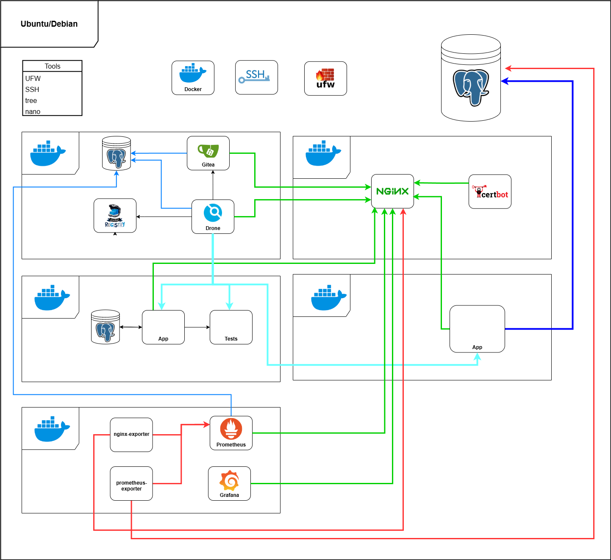

## Quick and simple deploy

 <br>

This repository designed for deployment of own small CI/CD environment.

The project consists:

- playbooks:
    - deployment main server services
    - configure base settings (users, security)
- CI/CD files:
    - composes
    - drone config
- directory templates

### Deploying stages

- Install base essential packages
- Creating new user and configuring them
- Setting SSH and UFW for security
- Installing and setting Postgres for test stage
- Preparing essential directories
- Starting ci/cd services(Drone, Gitea) in Docker

### Service interaction diagram



### Using

```bash

```

